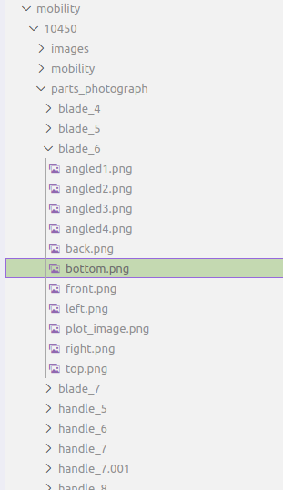
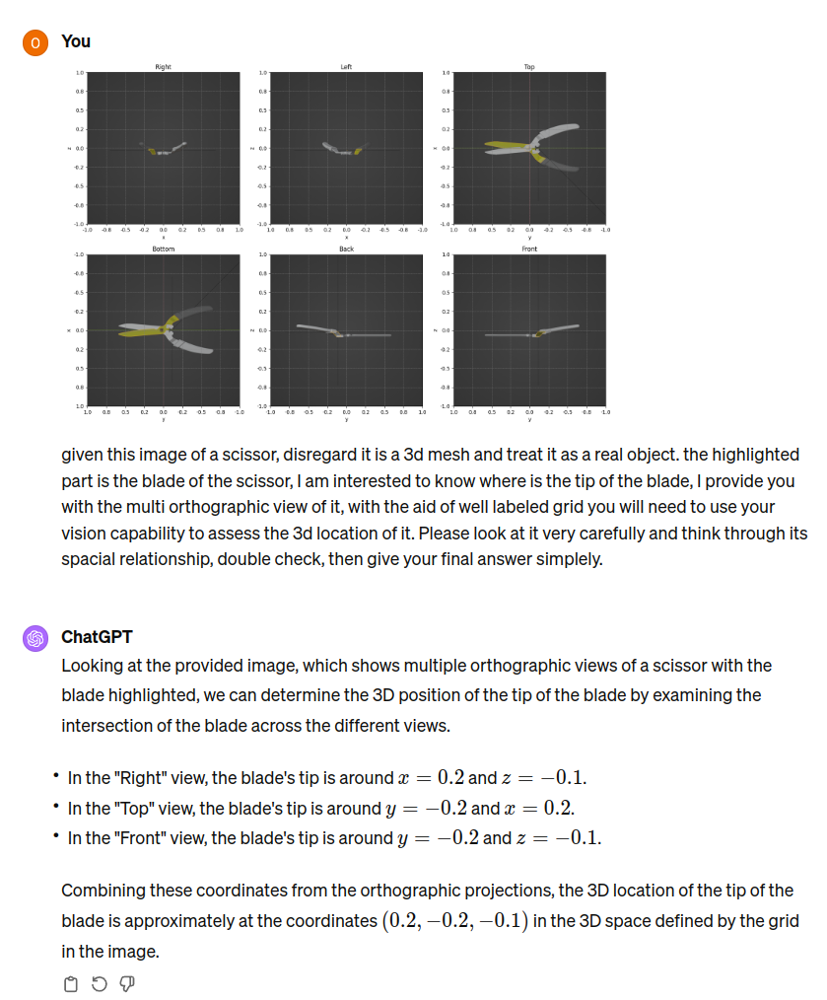

# Project Work Summary

## 1. Multi-Angle Part-Level Photo Taking

Our latest development allows for comprehensive photographic documentation of objects, with an emphasis on individual parts. The functionality introduced includes:

- **Perspective/Orthographic Switch** 
- **Grid Scale Calibration in Orthographic View:** Ensures precise measurements within the orthographic view.
- **Transparent Non-Highlighted Part:** Focus on the highlighted part by rendering non-selected parts transparent.

### File Structure Overview

Below is an example of the file structure created by our process:

### Photographic Examples

#### Orthographic Top View

Here's an example of an orthographic top view (`top.png`) generated by our code:

#### Multi-Angle View

An example of a multi-angle view (`angled4.png`), showcasing non orthographic view generation:

## 2. Collage of Orthographic Views

### Automatic Generation of `plot_image.png`

After collecting orthographic views, a collage is automatically generated by matplotlib. This feature provides a comprehensive overview of the object's parts in a single, informative image.

#### Example of `plot_image.png`

Below is an example of a `plot_image.png`, showcasing the collage of orthographic views:

###### End Work Summary

## Experiments and Thoughts

### Querying Waypoints

query template:

given this image of a scissor, disregard it is a 3d mesh and treat it as a real object. the highlighted part is the {handle/blade} of the scissor, I am interested to know the {coordinate/angle} of {tip/center/end}, I provide you with the multi orthographic view of it, with the aid of well labeled grid you will need to use your vision capability to assess it. Please look at it very carefully and think through its spacial relationship, double check, then give your final answer as {number/coordinates} simplely.

Waypoints such as "tip of the blade", "screw of the scissor", "center of handle", and "blade opening angle" 

- **tip of the blade**: GPT-4V returned (0.2,−0.2,−0.1), true:(0.05, 0.6, -0.05)

- **screw of the scissor**: GPT-4V returned (0, 0, 0), true:(0, 0, 0)

- **center of handle**: GPT-4v returned (0.2,0,−0.1), true: (0.2 ,-0.45, 0.05)

- **blade opening angle**: GPT-4v returned 60/70 degrees, true: 10 or 20 degrees

### Thoughts:

It feels like GPT-4v's visual capability at location detection is quite bad. We have also tested giving GPT only text of bounding boxes, and it also doesn't seem to reason in 3D but only pick up the relevant part name and calculate the center. I am a bit concerned if GPT aided waypoint annotation is not plausible given its poor spatial reasoning capability(also noted by openAI)

